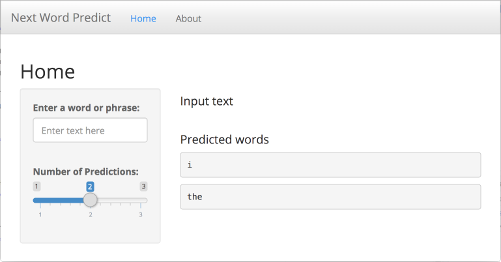

Next Word Predict
========================================================
author: Jeffrey M. Hunter
date: 28 July, 2019
autosize: true
transition: rotate
class: smaller
css: style.css

Coursera Data Science Specialization 
Capstone Project 
Johns Hopkins University 

========================================================
# **Objective**

<small>
This presentation features the Next Word Predict app
including an introduction to the application user
interface and details about the text prediction
algorithm.

The Next Word Predict app is located at:

<ul>
    <li><a target="_blank" href="https://jhunter.shinyapps.io/coursera-data-science-capstone/">https://jhunter.shinyapps.io/coursera-data-science-capstone/</a></li>
</ul>

The source code files can be found on GitHub:

<ul>
    <li><a target="_blank" href="https://github.com/oraclejavanet/coursera-data-science-capstone/">https://github.com/oraclejavanet/coursera-data-science-capstone/</a></li>
</ul>

Check back regularly as the codebase is continually being updated with
new features and improvements.
</small>

========================================================
# **Shiny Application**

<small>
Next Word Predict is a Shiny app that uses a text
prediction algorithm to predict the next word(s) based on
text entered by a user.

The application will suggest the next word in a sentence
using an n-gram algorithm. An n-gram is a contiguous sequence
of *n* words from a given sequence of text.

The text used to build the predictive text model came from a
large corpus of blogs, news and twitter data. N-grams were
extracted from the corpus and then used to build the
predictive text model.

Various methods were explored to improve speed and
accuracy using natural language processing and text mining
techniques.
</small>

========================================================
# **The Predictive Text Model**

<small>
The predictive text model was built from a sample of
800,000 lines extracted from the large corpus of blogs,
news and twitter data.

The sample data was then
tokenized and cleaned using the **tm** package and a number
of regular expressions using the **gsub** function. As
part of the cleaning process the data was converted to
lowercase, removed all non-ascii characters, URLs,
email addresses, Twitter handles, hash tags, ordinal numbers,
profane words, punctuation and whitespace. The data was
then split into tokens (n-grams).

As text is entered by the user, the algorithm iterates
from longest n-gram (4-gram) to shortest (2-gram) to
detect a match. The predicted next word is considered using
the longest, most frequent matching n-gram. The algorithm
makes use of a simple back-off strategy.
</small>

========================================================
# **Application User Interface**

<small>
The predicted next word will be shown when the app
detects that you have finished typing one or more words.
When entering text, please allow a few seconds for the
output to appear. Use the slider tool to select up to
three next word predictions. The top prediction will be
shown first followed by the second and third likely
next words. Click the image below for a larger view
of the user interface.
</small>

